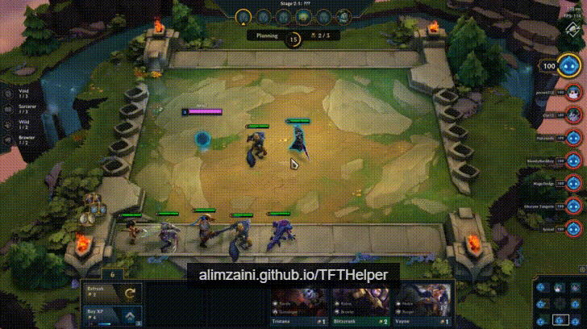
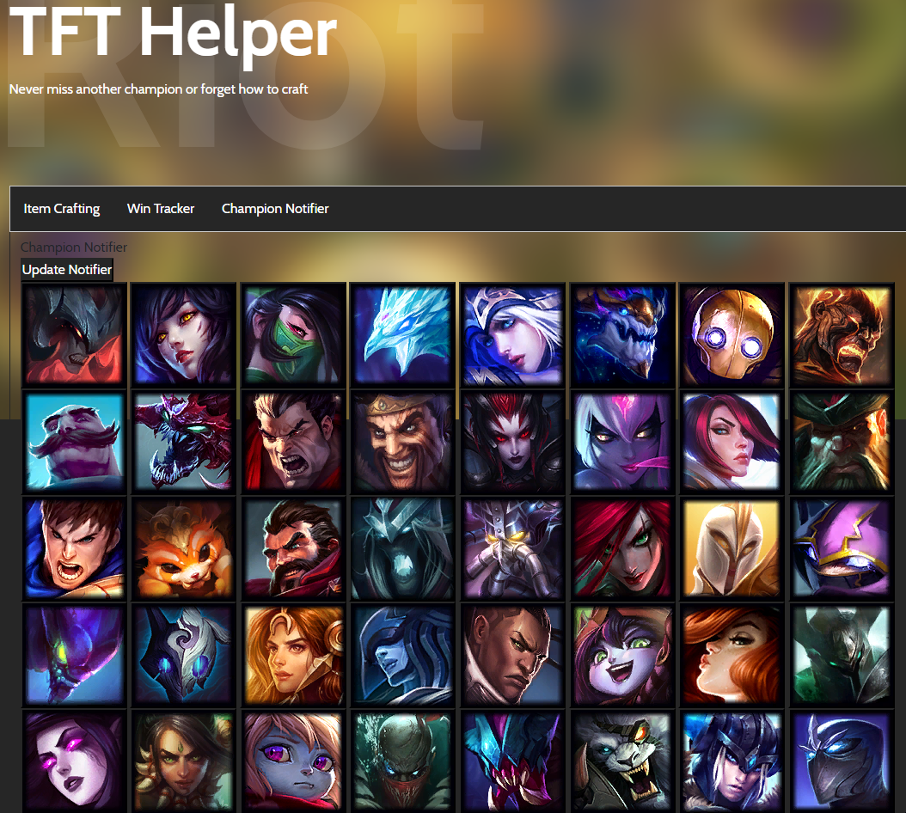
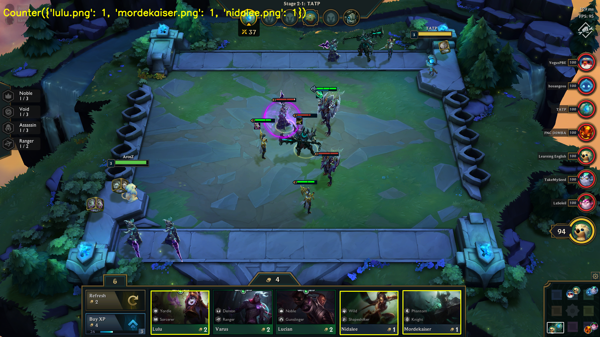

# TFTHelper
TFTHelper - Tools to help with Riot's TFT [OUTDATED]

# Item Cheat Sheet
Select the items you have to quickly see the items you could make.
If you want to try another set of items, press the Reset Selection button at the top.

You can use the tool here: https://zaini.github.io/TFTHelper/

You can open the website using an Overwolf Browser to make it an overlay on the game so you don't have to tab out: https://www.overwolf.com/app/Overwolf-Browser

## The following features have been put on hold indefinitely:

# Win Tracker
Tracks wins, loses and positions for every game and shows your winrate and average position. Requires manual input after every game.

# Champion Notifier
When a champion you want appears on screen you will be notified by a sound so you don't miss it.
Works by taking a screenshot of the game and analysing it. You can select which champions you are looking for from the tool.

# Item Notifier
Similar to the champion notifier but for items. Eventually it will use all the data collected to make suggestions on which items to get and build and on which champions to use them on.

# Extra
Some quick debugging for common errors:

* OSError: [WinError 10013] An attempt was made to access a socket in a way forbidden by its access permissions: ('localhost', 8000) - Means the port is probably unavailable, you don't have administrator access to it. port 8000 might be in use so you'll have to download the python code and edit it.

* "Failed to execute script" - People have had different solutions, try running it as administrator and try downloading it from another link such as from the link I provide here or downloading the whole GitHub repo. If you don't have Google Chrome installed, install it here: https://www.google.com/chrome/

* Is this bannable/within ToS? Is this safe? - The Item Sheet is literally just a seperate application, it makes no inputs to the game. It's completely allowed. Even the overlay features which are planned are allowed as they don't make any inputs to the game. It's similar to OPgg, Overwolf, Discord or HearthArena overlays. All the code is available to read if you want to check if it's safe. I'm an amateur programmer and if anything seems dodgy please tell and I'll try and fix it. VirusTotal may give false positives because I've used pyinstaller and it's a common problem with one of the modules I've used to be detected as a threat when it's not. [Reddit post in regards to this.](https://www.reddit.com/r/CompetitiveTFT/comments/c5rwqi/item_cheat_sheet_app_item_champion_and_win/es5sjwp/)
